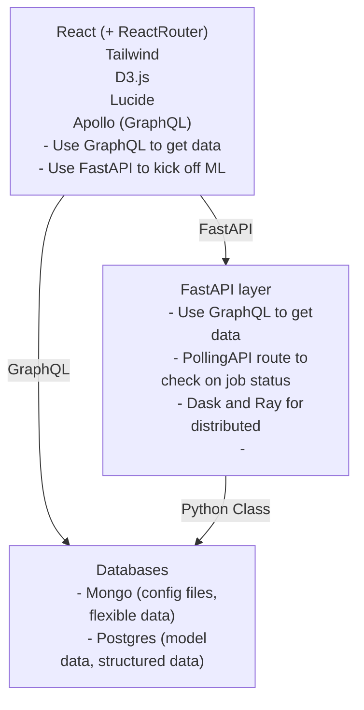

```mermaid
flowchart TB
    Frontend["
        React (+ ReactRouter)
        Tailwind
        D3.js
        Lucide
        Apollo (GraphQL)
        - Use GraphQL to get data
        - Use FastAPI to kick off ML
    "]
    Database["
        Databases
        - Mongo (config files, flexible data)
        - Postgres (model data, structured data)
    "]
    Backend["
        FastAPI layer
        - Use GraphQL to get data
        - PollingAPI route to check on job status
        - Dask and Ray for distributed
        - 
    "]

    Frontend -->|FastAPI| Backend
    Frontend -->|GraphQL| Database
    Backend -->|Python Class| Database
```