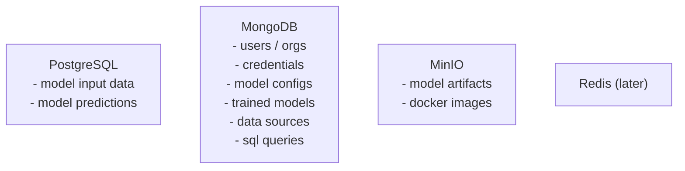

```mermaid
flowchart TB
    postgres[
    PostgreSQL
    - model input data
    - model predictions
    ]
    mongo[
    MongoDB
    - users / orgs
    - credentials
    - model configs
    - trained models
    - data sources
    - sql queries
    ]
    minio[
    MinIO
    - model artifacts
    - docker images
    ]
    redis["
    Redis (later)
    "]
```