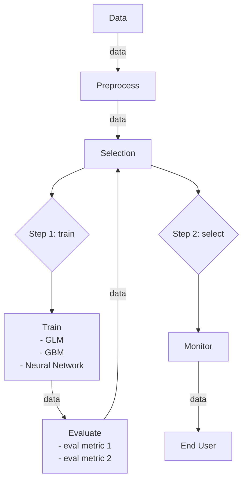

```mermaid
flowchart TB
    data[
    Data
    ]
    preprocess[
    Preprocess
    ]
    selection[
    Selection
    ]
    train[
    Train
    - GLM
    - GBM
    - Neural Network
    ]
    evaluate[
    Evaluate
    - eval metric 1
    - eval metric 2
    ]
    monitor[
    Monitor
    ]
    enduser[End User]
    train1{Step 1: train}
    train2{Step 2: select}

	data -->|data| preprocess
	preprocess -->|data| selection
	%% selection -->|data| train
    selection --> train1
    train1 --> train
	train -->|data| evaluate
	evaluate -->|data| selection
	%% selection -->|data| monitor
	monitor -->|data| enduser
    selection --> train2
    train2 --> monitor
```