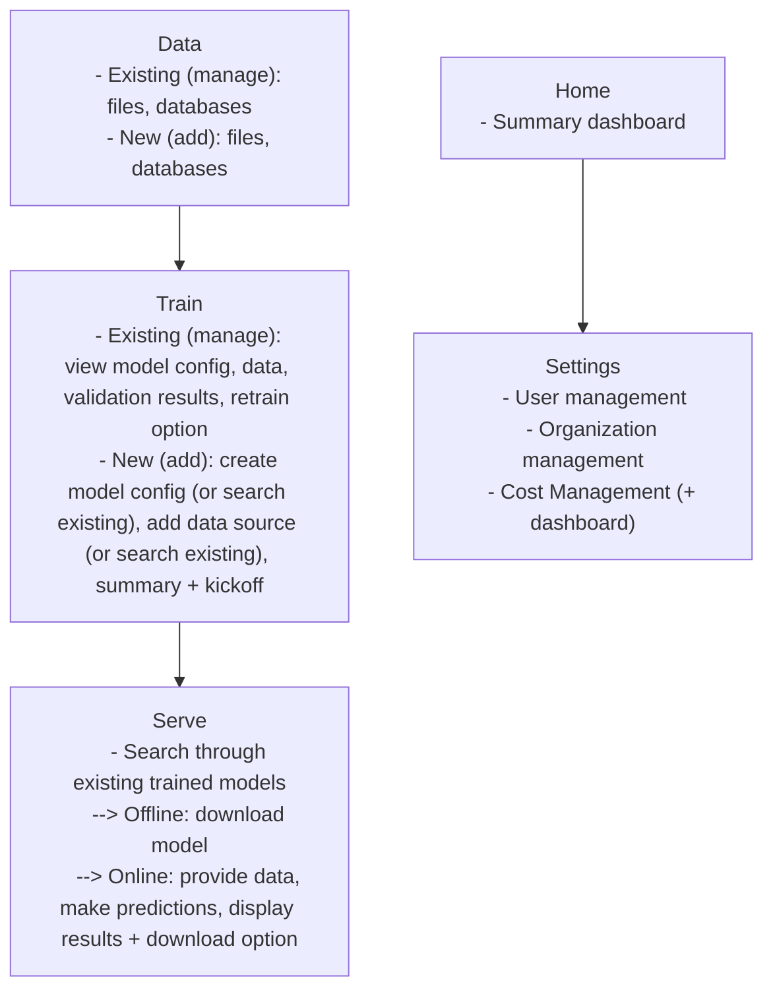

```mermaid
flowchart TB
    home["
    Home
    - Summary dashboard
    "]
    train["
    Train
    - Existing (manage): view model config, data, validation results, retrain option
    - New (add): create model config (or search existing), add data source (or search existing), summary + kickoff
    "]
    serve["
    Serve
    - Search through existing trained models
    --> Offline: download model
    --> Online: provide data, make predictions, display results + download option
    "]
    data["
    Data
    - Existing (manage): files, databases
    - New (add): files, databases
    "]
    settings["
    Settings
    - User management
    - Organization management
    - Cost Management (+ dashboard)
    "]

    home --> settings
    
    data --> train
    train --> serve
```